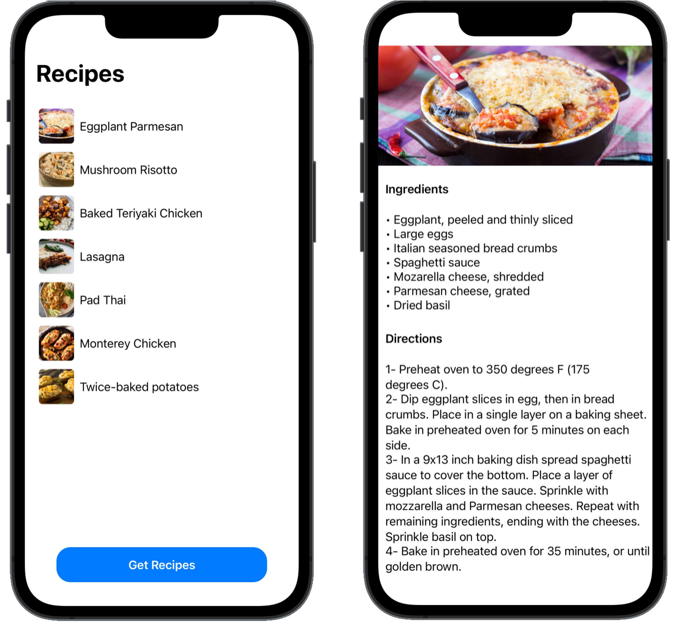

## Simple recipes app - Swift UI

This application was part of a 2 hour presentation that had as objectives:
 - Present the basic SwiftUI components
 - Show a simple way to integrate this new Framework into a MVVM architectue.

    

